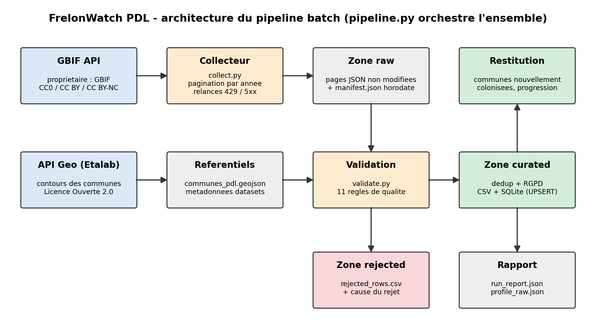

# FrelonWatch PDL — progression du frelon asiatique en Pays de la Loire

Projet personnel de collecte de données — ESEO 2026-2027, module *Architectures BD et collecte de données*.

> **Question centrale : à quelle vitesse le frelon asiatique progresse-t-il dans les Pays de la Loire,
> et quelles communes ont vu leurs premières observations récemment ?**

**Utilisateur** : un apiculteur ou un groupement de défense sanitaire apicole.
**Décision** : dans quelles communes placer en priorité les pièges à fondatrices au printemps.

Le pipeline collecte les observations publiques de *Vespa velutina* sur GBIF. Il les contrôle, les
déduplique entre plateformes, les rattache à une commune, supprime les données personnelles et
publie un jeu de données curated accompagné d'indicateurs.

Le cadrage détaillé de la séance 1 (fiche, cas d'usage, KPI, grain, dictionnaire) est dans
[docs/fiche_projet.md](docs/fiche_projet.md).

## Résultats (exécution du 23/09/2026)

| Indicateur | Valeur |
|---|---|
| Observations collectées (raw) | 1 750 |
| Rejetées (avec cause) | 112 |
| Doublons fusionnés | 109, dont 20 groupes inter-plateformes, tous confirmés par le clustering GBIF |
| Observations curated | 1 529 |
| Communes colonisées depuis 2008 | 453 |
| Nouvelles communes en 2025 | 17 |
| Communes touchées pour la première fois ces 12 derniers mois | 8 |

Fichiers produits pour l'utilisateur :
- `data/curated/communes_first_seen.csv` : une ligne par commune, avec la première et la dernière
  observation, les observations de printemps et l'indicateur `newly_colonised_last_12_months` ;
- `data/curated/progression_annuelle.csv` : nouvelles communes et cumul par année.

## Sources et conditions d'utilisation

| Source | Rôle | Accès | Licence |
|---|---|---|---|
| [GBIF](https://www.gbif.org) — API `occurrence/search` | Observations (source principale) | Public, sans clé | Par ligne : CC0 1.0, CC BY 4.0 ou CC BY-NC 4.0 |
| [API Géo](https://geo.api.gouv.fr) — `communes?codeRegion=52` | Contours des communes (enrichissement) | Public, sans clé | Licence Ouverte Etalab 2.0 |

Date d'accès : 23/09/2026. Filtres GBIF : `taxonKey=1311477` (*Vespa velutina*), `gadmGid=FRA.12_1`
(Pays de la Loire), `country=FR`.

Le projet est non commercial, donc les trois licences sont utilisables. La règle Q06 vérifie la licence
de chaque ligne, et `data/curated/attributions.csv` fournit l'attribution exigée par CC BY (titre, DOI,
lien de chaque jeu de données). L'analyse complète des sources, des licences et du RGPD est dans
[docs/source_assessment.md](docs/source_assessment.md).

## Prérequis et installation

Python 3.11 ou plus récent, et un accès Internet (api.gbif.org, geo.api.gouv.fr).

```bash
python -m venv .venv
# Windows : .venv\Scripts\activate      Linux / macOS : source .venv/bin/activate
pip install -r requirements.txt
```

> Sous Windows avec *Smart App Control*, les DLL de pandas installées dans un venv peuvent être bloquées.
> Dans ce cas, créez le venv avec `python -m venv --system-site-packages .venv` pour réutiliser le
> pandas déjà installé.

## Exécution

```bash
python src/pipeline.py --collect        # nouvelle collecte GBIF puis traitement complet (~40 s)
python src/pipeline.py                  # retraite la dernière collecte présente en zone raw
python src/pipeline.py --demo-invalid   # démonstration : 8 lignes piégées (sorties dans data/demo/)
python src/collect.py --years 2025,2026 # collecte seule, sur quelques années
python -m pytest -q                     # 27 tests unitaires
```

Toute la configuration (espèce, zone, seuils de qualité, chemins) est dans `config/pipeline.yaml`.
Aucun secret n'est nécessaire.

## Architecture



```
[GBIF API] -> [collect.py] -> [raw : pages JSON + manifest] -> [validate.py : 12 règles] -> [curated : CSV + SQLite] -> [indicateurs]
[API Géo]  -> [référentiel communes] ----------------------------^         \-> [rejected : cause du rejet]
```

1. **Collecte** (`collect.py`) : une requête par année (plus un bloc historique 1600-2003), pour rester
   sous le plafond de 100 000 résultats par requête. Pages de 300 lignes, relances exponentielles sur
   les erreurs 429 et 5xx, abandon propre sur les erreurs 4xx. Chaque page est écrite **octet pour
   octet** dans `data/raw/gbif_<horodatage>/`, avec un `manifest.json` qui trace la requête et les
   comptes.
2. **Profilage** (`profile_data.py`) : `reports/profile_raw.json` contient les types, les valeurs
   manquantes, les doublons, les plages de valeurs et les modalités fréquentes.
3. **Standardisation** (`transform.py`) : typage, dates normalisées (heure locale convertie en UTC,
   intervalles et années seules gérés), licences normalisées, rattachement à une commune par test
   point-dans-polygone (`reference.py`).
4. **Validation** (`validate.py`) : séparation entre lignes acceptées et rejetées, avec la liste des
   règles violées.
5. **Déduplication, RGPD et publication** : écriture atomique des CSV, UPSERT SQLite, rapport
   d'exécution.

## Arborescence

```
frelon-pdl/
├── README.md, requirements.txt, .gitignore
├── config/
│   ├── pipeline.yaml          # paramètres (source, zone, seuils, chemins)
│   └── data_contract.yaml     # contrat de données v1.0 (grain, 31 champs, règles)
├── data/
│   ├── raw/                   # collectes complètes (non versionnées) + sample_source.json
│   ├── reference/             # cache communes + métadonnées des datasets (non versionné)
│   ├── curated/               # observations.csv, communes_first_seen.csv,
│   │                          # progression_annuelle.csv, attributions.csv, frelon_pdl.sqlite
│   └── rejected/rejected_rows.csv
├── docs/                      # fiche_projet.md, source_assessment.md, architecture.png
├── reports/                   # run_report.json, profile_raw.json, runs/ (historique)
├── src/                       # collect, extract, profile_data, reference, validate,
│                              # transform, load, pipeline, make_sample
└── tests/test_quality.py
```

## Règles de qualité

| ID | Dimension | Condition | Action | Échecs (23/09) |
|---|---|---|---|---|
| Q01 | Complétude | latitude et longitude renseignées | Rejeter | 0 |
| Q02 | Domaine | point dans une commune des Pays de la Loire | Rejeter | 8 |
| Q03 | Validité | date lisible, ≥ 2004, non future, précision ≤ 1 an | Rejeter | 0 |
| Q04 | Domaine | incertitude de localisation ≤ 5 000 m | Rejeter | **104** |
| Q05 | Validité | espèce *Vespa velutina*, rang espèce ou infra-spécifique | Rejeter | 0 |
| Q06 | Conformité | licence CC0, CC BY ou CC BY-NC | Rejeter | 0 |
| Q07 | Cohérence | `occurrenceStatus = PRESENT` | Rejeter | 0 |
| Q08 | Complétude | incertitude de localisation renseignée | Signaler | 340 |
| Q09 | Unicité | clé métier unique | Dédupliquer | 109 |
| Q10 | Fraîcheur | dernière observation datant de moins de 120 jours | Alerter | 0 (19 j) |
| Q11 | Complétude | reçu = annoncé, et somme des tranches = total | Alerter | 1 |
| Q12 | Conformité | aucun nom d'observateur dans les sorties | Alerter (statut FAIL) | 0 / 980 noms |

La règle qui rejette le plus est **Q04** : 104 observations ont une localisation à plus de 5 km, ce qui
ne permet pas d'attribuer une commune de façon fiable. Les rejets Q02 sont des points sur l'estran ou
juste au-delà de la limite régionale, car les contours GADM utilisés par GBIF diffèrent légèrement des
contours INSEE.

Le mode `--demo-invalid` injecte une ligne par règle Q01 à Q07, plus un faux doublon. Chacune est
rejetée par la règle attendue, et le doublon est fusionné.

## Déduplication et idempotence

**Clé métier** : `observation_key` = SHA-1 de (espèce, jour, latitude à 3 décimales, longitude à 3
décimales). Une même observation peut arriver sur GBIF par plusieurs canaux, par exemple iNaturalist et
l'inventaire national Frelon du MNHN.

1. **Doublons techniques** : un `gbifID` vu deux fois (chevauchement de pages) est supprimé.
2. **Doublons métier** : les enregistrements qui partagent la même clé sont fusionnés. On garde la
   localisation la plus précise, puis la licence la plus ouverte. Les identifiants fusionnés sont
   conservés dans `source_gbif_ids`, et `n_source_records` / `n_source_datasets` indiquent combien de
   lignes et de sources ont été regroupées.
3. **Contrôle croisé** : les 20 groupes inter-plateformes détectés sont tous aussi marqués
   `isInCluster` par l'algorithme de clustering de GBIF.

**Rejeu** : les CSV sont réécrits de façon atomique (fichier temporaire puis remplacement), et la base
SQLite utilise `observation_key` comme clé primaire avec `INSERT … ON CONFLICT DO UPDATE` (UPSERT) et
une contrainte `UNIQUE` sur `gbif_id`. Une seconde exécution donne `inserted: 0`, `rows_after: 1529`.

## Rapport d'exécution

Chaque exécution écrit `reports/run_report.json` (et une copie historisée dans `reports/runs/`) :
lignes en entrée, acceptées, rejetées et fusionnées, échecs par règle, alertes, colonnes personnelles
supprimées, KPI, statistiques de la base, statut `PASS` / `PASS_WITH_WARNINGS` / `FAIL`, et durée.

## Données personnelles

Les champs `recordedBy`, `identifiedBy`, `rightsHolder`, `nick`, `verbatimLocality` et les champs
associés sont supprimés dès la sortie de la zone raw. Celle-ci n'est pas versionnée ; seul un extrait
masqué l'est. Les coordonnées sont arrondies à environ 100 m, et `source_channel` est normalisé, car
certains titres de jeux de données contiennent un nom. La règle Q12 vérifie à chaque exécution
qu'aucun nom ne se retrouve dans les sorties. Justification détaillée :
[docs/source_assessment.md](docs/source_assessment.md#données-personnelles-rgpd).

## Limites connues et améliorations

- **Biais d'observation** : la baisse apparente des nouvelles communes après 2018 (environ 45 par an
  entre 2013 et 2018, contre 4 à 19 ensuite) reflète surtout une **baisse de la publication vers GBIF**
  (moins de données de l'inventaire national), pas un ralentissement de l'espèce. Les signalements
  terrain des GDSA (plateforme Frelon asiatique, déclarations en mairie) ne sont pas sur GBIF. Une
  absence d'observation ne signifie pas une absence de frelon.
- **17 observations sans année** ne sont renvoyées par aucune tranche annuelle. L'alerte Q11 les
  signale. Amélioration : une requête complémentaire sans filtre d'année, puis une différence par
  `gbifID`.
- **Clé métier à environ 100 m** : deux plateformes qui arrondissent différemment la même observation
  (centroïde de commune contre point GPS) ne sont pas fusionnées. Amélioration : s'appuyer sur l'API de
  clustering GBIF (`/occurrence/{id}/experimental/related`).
- **Snapshot complet** : une observation supprimée de GBIF disparaît du CSV mais reste en base SQLite.
  Amélioration : marquer les lignes absentes du dernier snapshot.
- **Passage en production** : planification hebdomadaire (cron ou GitHub Actions), téléchargement GBIF
  avec DOI pour la citation, tableau de bord cartographique pour les apiculteurs, et une seconde source
  terrain (signalements des GDSA).
